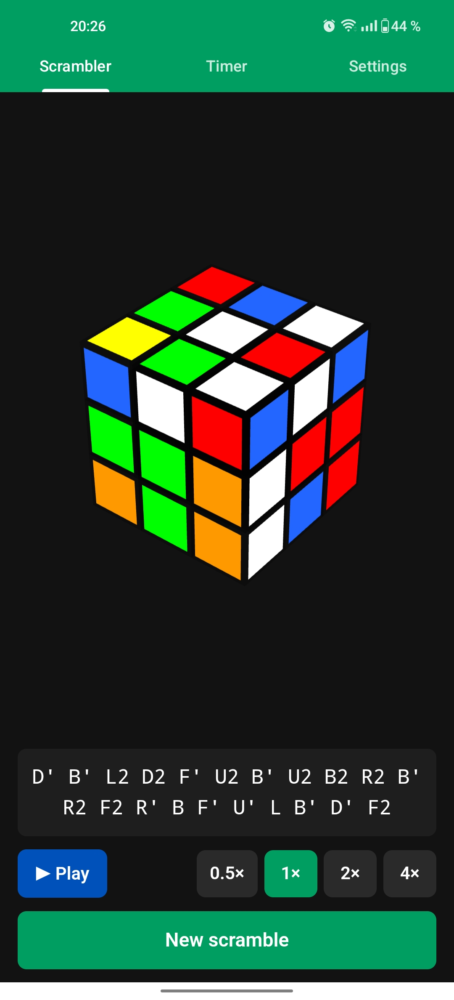
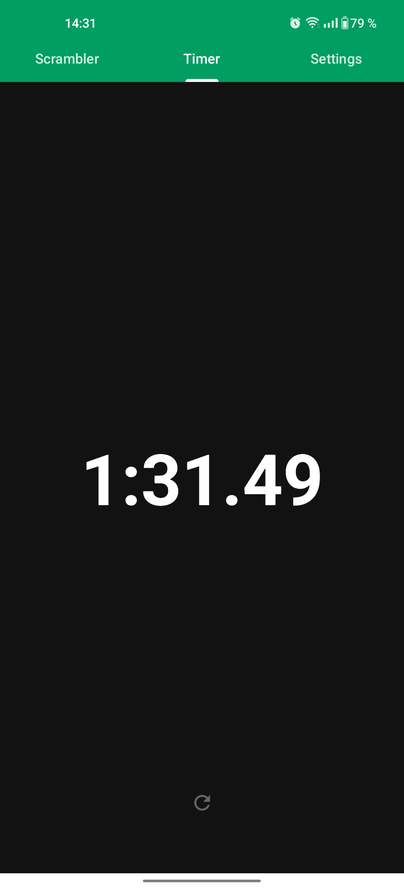
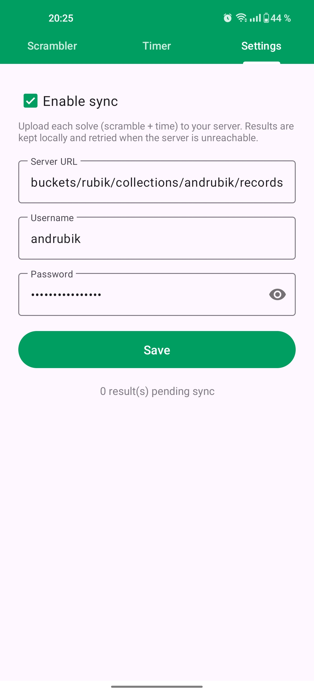
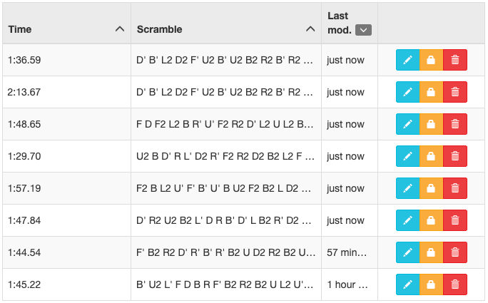

# AndRubik

AndRubik is an Android application designed for Rubik's Cube enthusiasts, specifically focused on the 3x3 standard cube.
AndRubik aims to enhance the cubing experience by providing essential tools for scrambles, timing, and solving directly from your Android device.

## Screenshots

## Features

* Scrambler: The application includes an intuitive scrambler interface inspired by [js.cubing.net](https://js.cubing.net/), utilizing a scrambling algorithm based on [js.cubing.net](https://js.cubing.net/).
* Timer: A specialized timer designed for cubers that starts when the user's hand leaves the screen and stops with a new touch, leveraging the standard Android backend.
* Solver: (Not implemented yet) A solver functionality that utilizes the device's camera to capture the cube's state, with solving algorithms based on [ruwix.com](https://ruwix.com) and available at [cubing.net](https://cubing.net).
* Sync: Opt-in JSON sync, tested with a [Kinto Storage](https://www.kinto-storage.org/) backend

## License

MIT License - Refer to [LICENSE](LICENSE)

